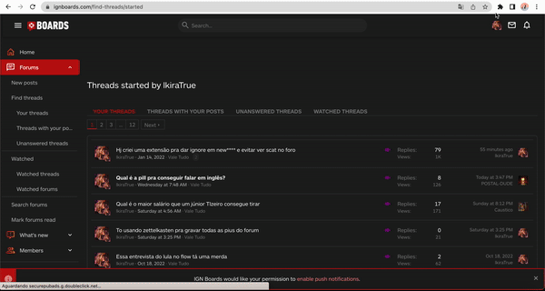

# extensao-anti-clone-do-lkiraTrue
Extensão anti-clone para o forum ignboards do usuário lkiraTrue.

## Novidades da versão 4.0:
- Bloqueia threads de usuarios com poucas mensagens na home do forum, para isso é preciso visitar um de seus posts.
- Checkbox para permitir usuários mesmo que nao tenham a quantidade mínima de posts.
- Corrige o bug do twitter, converte automaticamente os links do X.com, para twitter.com
- Corrige o bug do shorts do YouTube, converte automaticamente.

## Como usar
Para usar essa extensão você precisa configura-la informando a lista de users que quer ignorar e a quantidade minima de posts pra não ser ignorado.
na pasta img tem um gif mostrando um exemplo de uso.

